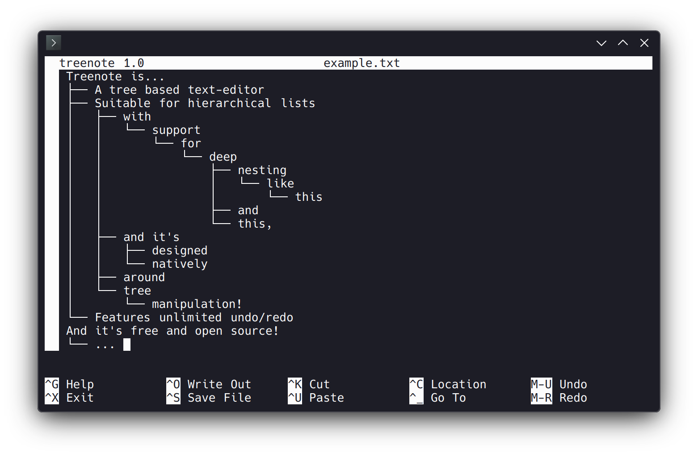

# Treenote – the Tree Editor

Treenote is a terminal-based text editor for trees.



The user interface and controls have (mostly) been copied from
[GNU nano](https://www.nano-editor.org/), although unlike nano, the editor
itself is designed around editing and rearranging elements of hierarchical 
lists instead of flat text or code. Other features include near-unlimited
undo and redo, and the ability to copy and paste subtrees.

Treenote has partial UTF-8 support. Single-code-point grapheme 
clusters are mostly supported, although right-to-left text and full-width 
characters do not function correctly. Grapheme clusters with more than one 
code point currently result in visual error.

## Installing Treenote

Treenote requires a sufficiently recent version of
[ncurses](https://invisible-island.net/ncurses/).
It has been tested to work with ncurses 6.5, but earlier 
source-compatible versions will probably still work.

A recent standard library version *(libstdc++ >= 14 or libc++ >= 18)*
with support for C++26 saturation arithmetic is also required.

1.  Clone this repo:
    ```txt
    git clone ...
    cd treenote
    ```

2.  Build and install:
    ```txt
    mkdir build && cd build
    cmake ..
    cmake --build .
    cmake --install .
    ```

## Using Treenote

Selected controls are listed at the bottom of the screen, and a full list of
controls can be found on the help screen (`Ctrl+G`). In general,
the keyboard controls are similar to those of GNU nano, with a few exceptions. 

Of particular note, the tree-editing controls are as follows:

- `Insert` to insert a new node in the tree.
  - `Ctrl+Insert` to insert a new node as a child of the current.
  - `Alt+Insert` to insert a node after the current.
  - `Shift+Alt+Insert` to insert a node before the current.
  - `Alt+Enter` to insert a new node.

- `Shift+Delete` to delete a node.
  - `Alt+Delete` to recursively delete a node and its children.
  - `Shift+Alt+Delete` to delete a node without deleting its children.

- `<arrowkey>` to move the cursor 
  - `Shift+<arrowkey>` to move the cursor between nodes.
  - `Alt+<arrowkey>` to move the current node within the tree.
  - `Tab` and `Shift+Tab` to raise and lower a node within the tree.

To change any of the controls, edit `keymap::make_default()` on line 255 of 
`src/tui/keymap.cpp` and recompile.

